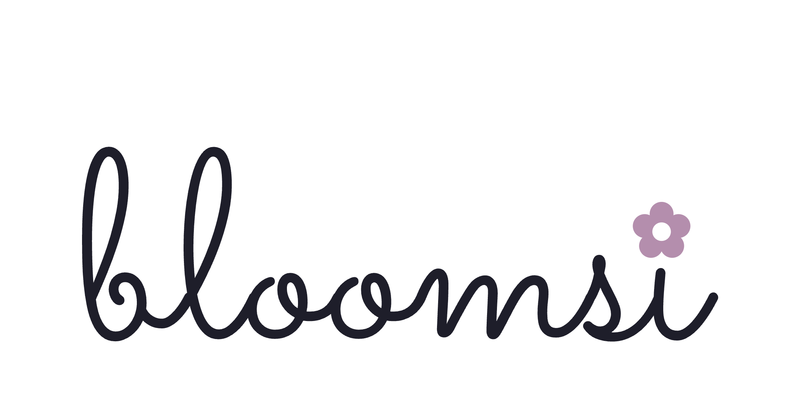

# Bloomsi brand

Owner-approved name and logo, 13 September 2026.

- **Platform name:** Bloomsi. Use this spelling in prose and user-facing copy. The supplied wordmark is lowercase.
- **Domain:** bloomsi.app. The owner reports purchasing this domain; DNS and deployment are separate work.
- **Business brand:** Bloomwired remains the agency/business name.
- **Previous platform name:** BloomOps. Older documents, screenshots and technical identifiers may still use it; they refer to the same platform, not a second product.

## Official logo

Canonical asset: [public/brand/bloomsi-lockup-charcoal.png](../public/brand/bloomsi-lockup-charcoal.png). This is the owner's original PNG, copied without alteration. When incorporated into the application, its public path is `/brand/bloomsi-lockup-charcoal.png`.

Use the supplied charcoal script wordmark and mauve flower as the branding reference. Preserve the artwork, colours, proportions and transparency. Present this charcoal version against a light background with comfortable space around it. Do not recreate it with a script font, substitute an initial tile or emoji, stretch it, or copy branding from generated mockups. A separate favicon/icon-only or dark-background asset has not been supplied in this handoff; do not treat an invented variant as approved.

## Apply in future edits

Use **Bloomsi** for platform headings, navigation branding, page titles, onboarding copy and new documentation. Link back here rather than relying on older BloomOps/Bloom Studio labels in mockups. Preserve actual workspace names, customer names and historical release evidence.

Reuse the current design system and the [profile layout reference](https://github.com/Bloomwired/bloomops/blob/bee6af59a1bb7a33c38107e38a17bc15b65d8bd6/docs/design-references/README.md); this logo does not replace the owner's spacing, readability or accessibility requirements. Prospect favicons and garden SVG fallbacks identify individual businesses, separately from Bloomsi's platform logo.

The GitHub repository and existing package names, database names, deployment identifiers and environment configuration remain unchanged by this asset/documentation handoff. Introducing the brand into running screens is implementation work; this commit does not claim a live rebrand, DNS cutover or deployment.
