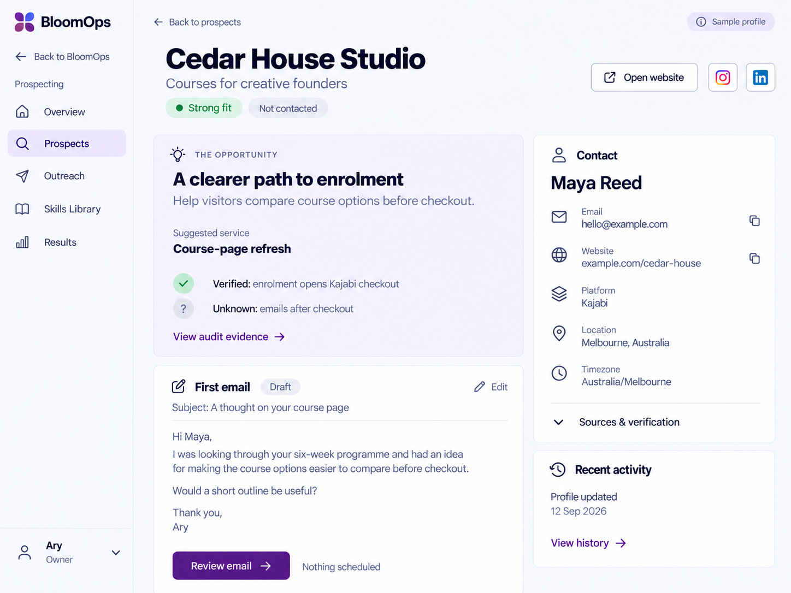

# Prospect profile visual reference

For the Prospects spreadsheet, use [the sheet build contract](../PROSPECTING_SHEET.md) and its three linked images. The sheet and full-page profile are both required views of the same records.

Brand update: the platform is now **Bloomsi**. Use the [official owner-supplied logo and brand guide](../BRANDING.md). Any BloomOps/Bloom Studio labels or generated marks in this mockup are superseded.

Owner feedback recorded 13 September 2026. Use this image and the corrections below when editing the Prospecting profile. The corrections take precedence wherever the mockup differs. This is a generated design reference with fictional data, not a screenshot of shipped functionality or audit evidence.

## Required correction: business icon

Keep a compact icon **before the business name**. Use the actual website favicon when available. If it is unavailable or fails to load, use a garden-themed SVG from the app's fallback library. The owner has already requested favicon detection elsewhere: inspect and reuse that implementation/library before adding another mechanism. Keep the fallback stable for each prospect. Do not use initials, acronym tiles, or letter avatars as the fallback. The image omits this business icon; that omission is not the desired design.

## Header and social links

- Place icon-only social links beside **Open website**, as in the image. No visible social-network words beside them.
- Render each social icon only when the audit has identified a real profile URL belonging to the business/person. Do not treat share links as profiles or invent handles. When none are found, omit the icons and empty placeholders.
- The Instagram and LinkedIn icons shown here are fictional examples, not defaults for all records.
- Provide accessible link names, keyboard focus and hover/focus tooltips without permanently visible labels. Keep comfortable click targets.

## Layout and readability

- Use the image's direction for hierarchy: business identity, opportunity and proposed service, draft, then supporting contact/evidence/history.
- Keep the full-page profile and existing BloomOps design tokens/components. At desktop widths, opportunity/draft and contact information sit alongside one another; they are not stacked side drawers.
- Allow comfortable scrolling. Do not squeeze every section into one viewport, shrink type, or compress paragraph/field spacing to imitate an image's dimensions.
- Use consistent useful icons and clear labelled contact fields. Do not turn every property into a pill or card.
- Keep social links in the header action group; do not restore a separate labelled social row below the subtitle.
- Keep detailed evidence, sources and full activity accessible through disclosures or focused views. Avoid long repeated activity entries in the main profile.
- No dot-separated metadata chains or substitute separator chains. No acronym pictures. Use the official Bloomsi brand asset rather than copying generated branding.
- Adapt naturally at phone widths: stack content and wrap actions with adequate gaps and touch targets. Preserve readable labels and keyboard access.

## Scope and truthfulness

Reuse canonical profile data and current behaviour. Do not hardcode the fictional name, email, Strong fit, suggested service, detected socials or activity shown in this reference. Preserve separate fit/outreach states, known/unknown evidence and current automation rules. Only show sidebar features that are available in the implemented phase. The reference does not authorise sending emails, new automations, video work, migration or deployment.

Before calling the UI change complete, visually inspect desktop and narrow layouts against this direction **and the business-icon correction**, with favicon success/failure and social links present/absent. Follow the main [design checklist](../DESIGN_CHECKLIST.md) and [Prospecting roadmap](../PROSPECTING_ROADMAP.md).
