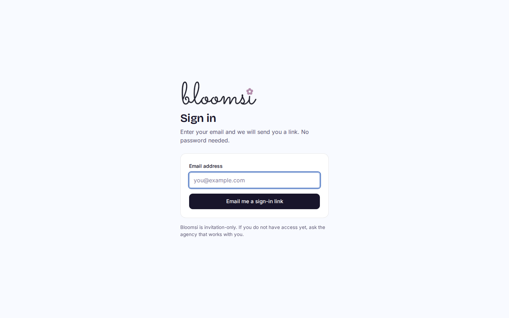
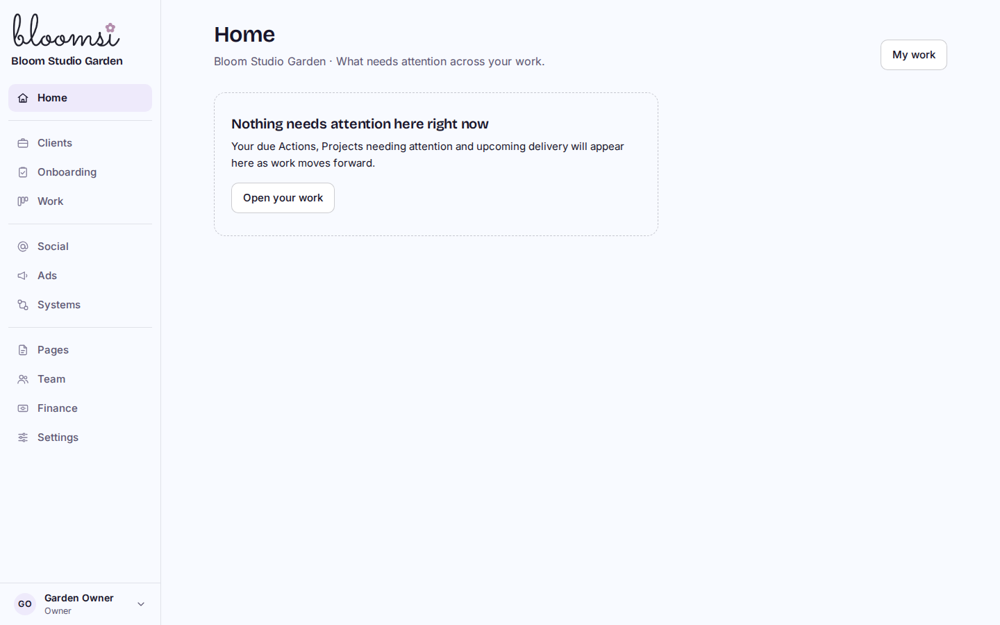
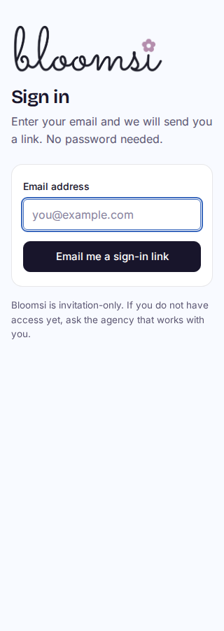
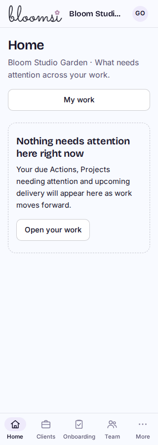

# Bloomsi branding preview

The approved [brand guide](../../BRANDING.md) and original PNG came from PR #58 at `bee6af59a1bb7a33c38107e38a17bc15b65d8bd6`. Only those two files were imported; the guide's profile-reference link points to that source commit. No roadmap or Prospecting runtime is included.

| Sign in | App shell |
| --- | --- |
|  |  |
|  |  |

[Tablet shell](internal-768.png) and [phone portal](portal-320.png). These are inspected local built-Worker captures with synthetic data. “Bloom Studio Garden” is intentionally a workspace name and stays unchanged. Account avatars identify people, not the platform.

## Verification

- 54 existing shell/auth/mail/config tests pass. No video tests.
- Cloudflare build passes after an isolated `npm ci`. A shared-dependency symlink caused the first built preview to fail; the isolated locked install fixed the packaging failure without changing runtime/configuration or dependency versions.
- [64 browser checks](results.json) pass at 1440, 1024, 768, 390 and 320px: actual unmodified PNG bytes, readable logo/proportions, titles, no horizontal overflow, preserved workspace names, keyboard sign-in, local magic-link mail, account sign-out and no runtime errors.
- The full original PNG is served unchanged. CSS clips only excess transparent canvas, retaining clear space around the complete artwork. No generated or icon-only variant, favicon, dark logo, font recreation or colour change.
- No schema, workspace record, technical identifier, credential, DNS or production change. The existing staging workflow and its migration/bootstrap/verifier gates are retained. The verifier now expects Bloomsi and the approved logo path. Real configured sender settings remain unchanged; the fallback sender display name and mail text use Bloomsi.
- One fresh Sol High review and one focused re-review are complete with no remaining finding. Long-name sidebar containment was fixed and verified in the [desktop stress capture](internal-long-1440.png). The reviewer retracted the portal clipping finding after the [320px header capture](portal-header-320.png) and full-artwork containment/separation checks. Staging publication is pending. Evidence: `/home/ary/Developer/bloomops-bloomsi-evidence/`.

## Reproduce locally

Use the existing isolated development schema and `r2-dev` mail, run `npm run cf:build`, then `node scripts/navigation-perf-local.mjs`. With the existing Playwright installation at `/tmp/bloomops-pilot-tools`, run `LD_LIBRARY_PATH=/tmp/bloomops-pilot-tools/libs/usr/lib/x86_64-linux-gnu node scripts/bloomsi-branding-browser-local.mjs /tmp/bloomsi-branding`. The harness refuses a nondevelopment/nonlocal-mail target before seeding synthetic records. No sign-in links or secrets are written to captures/results.
