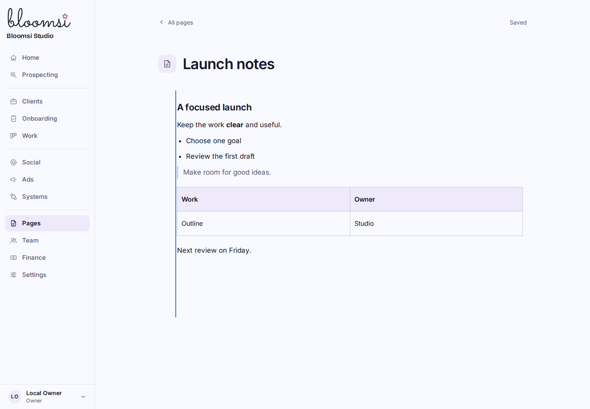
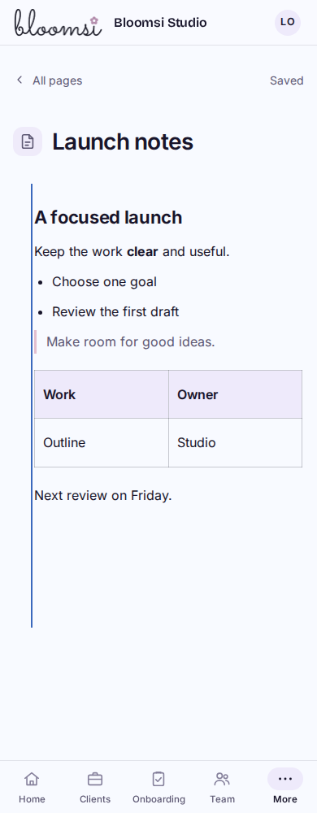

# Workspace Pages — first working slice

Actual built Worker captures from an isolated synthetic workspace. Main Pages supports creation, full-page rich writing and serial autosave. The existing Bloomsi shell and rich editor are reused.

Verified at1440/1024/768/390/320: title/body autosave, headings/lists/quotes/tables through reload, slash insertion, keyboard writing, network failure, same-tab recovery, draft download, conflicting edits, explicit saved-version selection, edits during an in-flight save, return to Pages and denied/foreign access.45 built-browser checks pass with zero provider requests and no legacy operational API calls.

The initial slice is Owner/Admin authoring. Nested page navigation/movement, search, icon selection, attachments and sharing remain later P4 work. No legacy pages were copied and no deployment occurred. See [BUILD_STATE](../../BUILD_STATE.md) for final review status.
