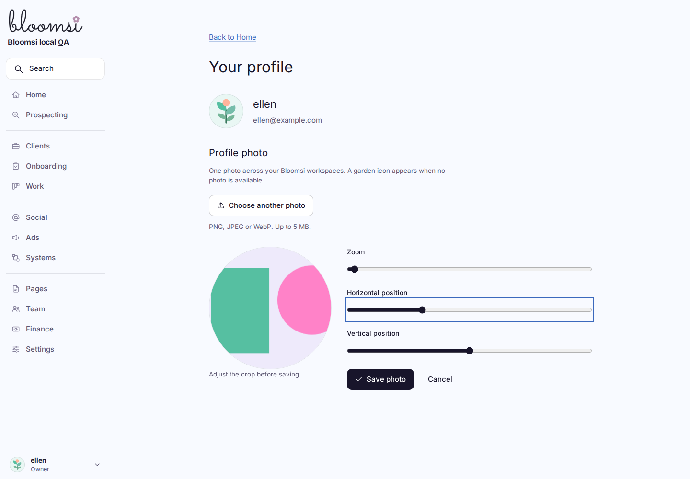
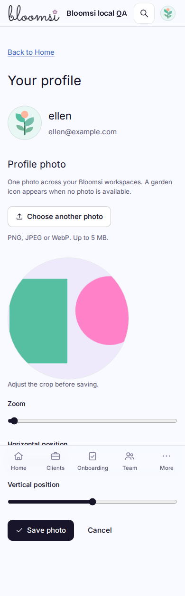
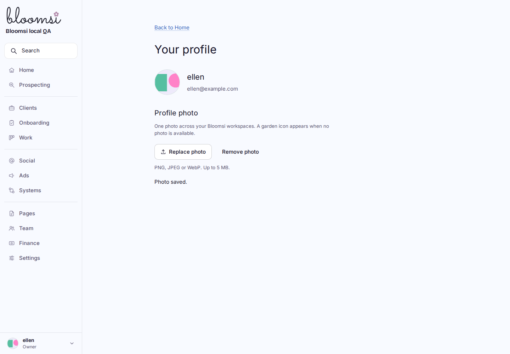
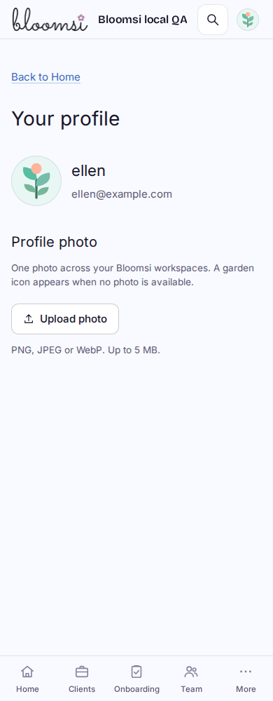
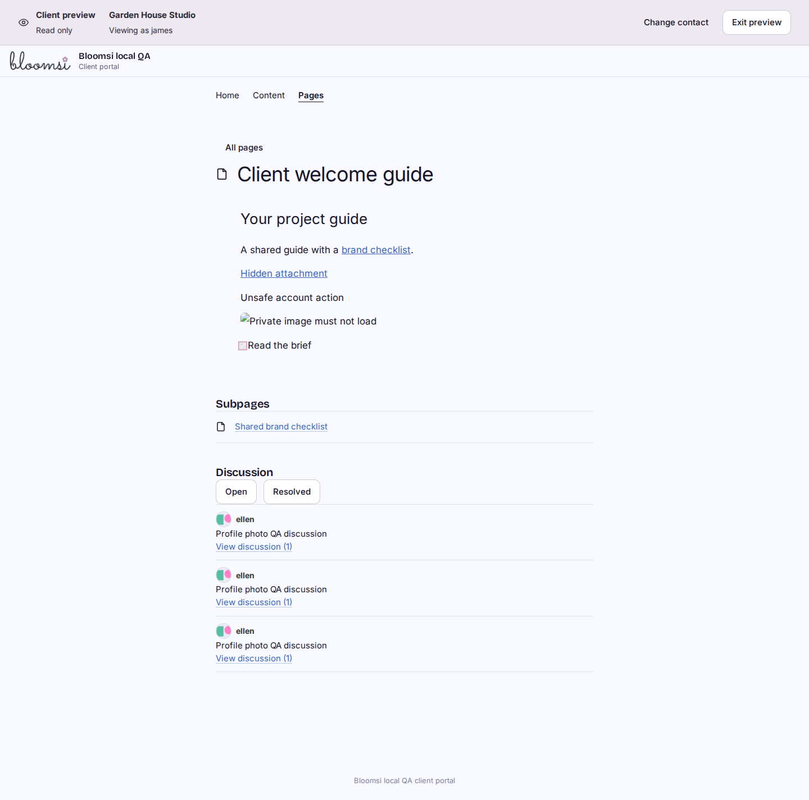

# N2C profile photos

Personal profiles reuse the existing account identity and FILES storage. Account → Your profile opens a PNG/JPEG/WebP crop with labelled zoom/position controls and explicit Save photo, Cancel and Remove photo. Photos are account-wide; only their owner can change them. The official Bloomsi logo stays separate.

Stored images are256px PNG thumbnails, at most300 KiB, never originals or remote URLs. Browser originals are bounded at5 MiB/16 megapixels; the server independently validates its fixed-size PNG input, checks CRCs and bounded decompressed scanlines, then repacks without metadata. Replaced/removed and uncertain-attempt objects remain retained; only the current user-owned pointer can be delivered. Nonce-based removal prevents old empty-profile retries from restoring a removed image. Conditional R2 writes and D1 compare-and-set protect concurrent/lost-response saves. Better Auth's generic image update is refused while own-name changes continue working.

Photos appear in Account, the existing authorized Team directory and Page discussions, including client preview. Image endpoints require current audience access and recheck after storage; no raw-key, public-user-directory or third-party proxy route exists. Client author photos require an actual comment on a currently readable Page. Every image response is private/no-store. Fallbacks reuse the prospect garden SVG without changing favicon detection. Focus and successful local photo saves refresh visible identity images; this is not cross-device push.

## Verification

- Focused Node suite102/102 (`bloomops-profile-photos`, auth, authorization, Page sharing, client preview), plus the added bounded-directory query check. The final photo-domain file is24/24, giving103 distinct focused checks overall. No video suite was invoked.
- Final production Worker build passed (`bloomops-n2-photos-build-reviewed.log`).
- Final actual Worker/R2 browser harness:35 checks pass (`bloomops-n2-photos-browser-reviewed.log`). PNG upload, JPEG/WebP selection, invalid SVG, crop controls, loading/failure retention, same-request lost-response retry, stale removal, real Team/Page/preview delivery, client isolation and own-profile navigation. Five widths1440/1024/768/390/320, no overflow and phone Save hit tests.
- Visual QA caught an image that finished loading before hydration and could remain transparent; UserAvatar now also checks `complete`/`naturalWidth`. The browser assertion now requires rendered opacity, not only decoded image dimensions. The rebuilt Worker passes the visible-photo regression.
- Photo delivery uses two bounded domain SELECTs plus one R2 read; the count remains two with250 extra members. Request authentication is additional. Empty-photo paths use one domain SELECT. This adds lazy thumbnail requests; it does not claim zero network cost or remote latency performance.
- Rounded first-load route estimates remain Clients161 kB, Prospecting123, Pages118 and Work108. New Profile118 kB. No dependency, schema or infrastructure change.

Logs are under `/home/ary/Developer/` with the filenames above; the repeatable harness is `scripts/profile-photos-browser-local.mjs`. All mutations and mail capture use fictional task-only local accounts. Initial harness-only corrections waited for profile metadata and scoped alerts past Next's route announcer. Staging photo mutations on the owner's identity are deliberately not used as QA.

One fresh Sol High read-only review found no material findings. No re-review was needed. Draft PR and staging acceptance are pending. This does not close N2D/E or broader recovery. Paid/video work, original LTB records/voices, production/DNS, imports/outreach and collaboration email remain paused.

Runtime references checked14 September2026: [Worker compression streams](https://developers.cloudflare.com/workers/runtime-apis/web-standards/#compression-streams) and [conditional R2 writes/checksums](https://developers.cloudflare.com/r2/api/workers/workers-api-reference/). No configuration was changed.

## Visual previews

Fictional local accounts and a geometric test photo; no real identity photo changed.

