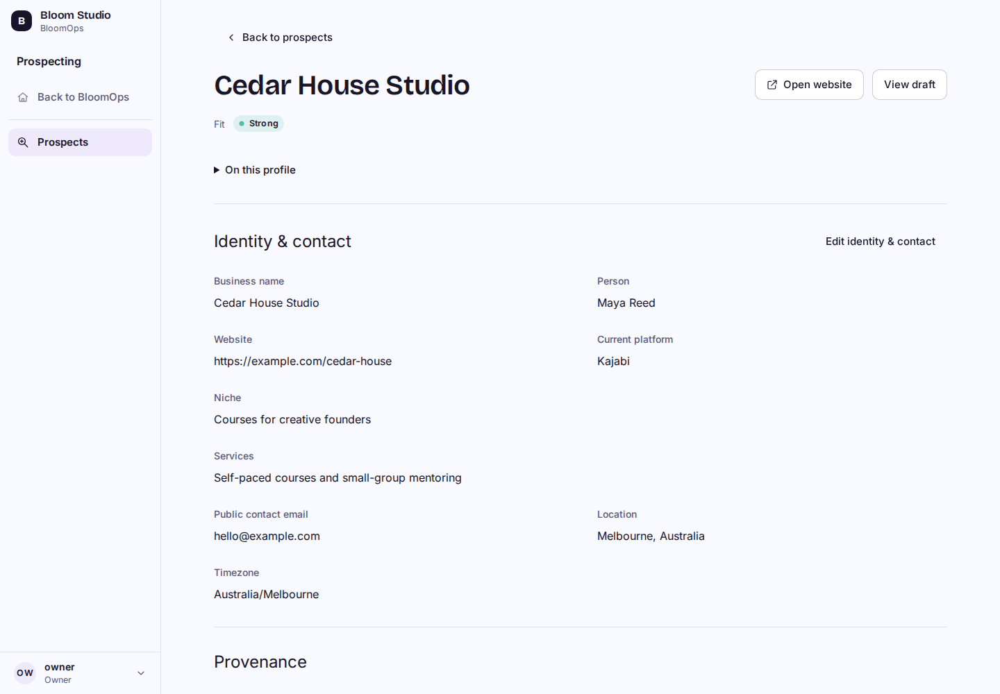
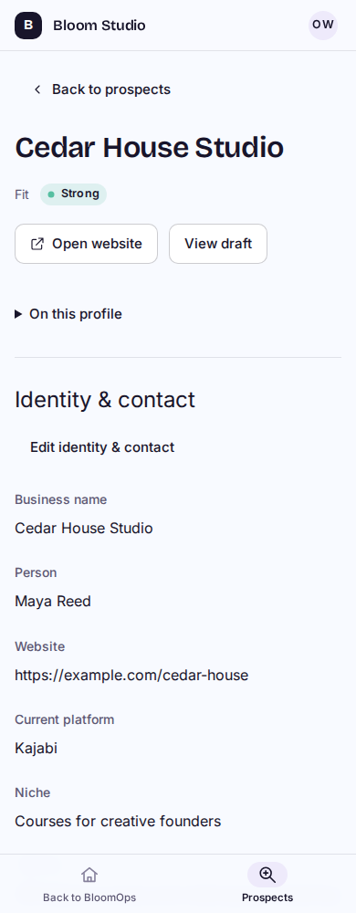

# Prospecting P0/P1 visual preview

Synthetic local built-Worker screenshots; all people, businesses, emails and observations are fictional. This is a review branch, not a deployed workspace. Original LTB records, voices and connections were not accessed or changed.

| Desktop | Phone (390px) |
| --- | --- |
|  |  |

[Full profile with assessment, draft and activity](profile-full.png) and [Prospect list](prospects-list.png).

The supported flow is Switch workspace → Create workspace → New prospect → full-page profile. Identity/contact, fit, facts/unknowns/proposed work, dated manual evidence and drafts are editable. Source checks and actor/time history remain separate. Saving a draft does not send or schedule anything.

## Verification

- 3,467 BloomOps tests passed, including authorization, schema, legacy compatibility and new workspace/profile invariants.
- 68 existing Pages/editor/tree/sharing/embed tests passed; no video tests run.
- 33 disposable native workerd/D1/R2 checks passed, including populated upgrade, original record/settings/object preservation, isolation, concurrent creation/save, rollback and immutable identities.
- 64 built-Worker browser assertions passed ([full checklist](browser-checks.json)). List/profile/editor checked at 1440, 1024, 768, 390 and 320px. Keyboard focus, 44px mobile fields, failed/conflicting saves, saved/unknown/empty states, reduced-motion preference, live role/revocation checks and workspace recovery exercised. No browser runtime errors. [Six additional checks](additional-browser-checks.json) cover the workspace chooser at all five widths and disabled fields during a pending save.
- Cloudflare build and isolated local zero-to-current/repeat verification passed; 26 migrations, 48 domain tables. No deployment or remote database mutation.
- Bloomlab’s live `/design` reference returned 200 and was visually inspected. Existing Bloom fonts, palette, controls and navigation were retained; metadata uses separate labels/values.
- One independent Sol High review and its single focused re-review are complete, with no remaining material code findings. The medium finding (source controls only exposed for Identity) was fixed for every section. After that UI-only fix, 13 focused tests, all 64 browser assertions and the Cloudflare build passed again; schema/domain/auth remained unchanged.

## Navigation comparison

Same synthetic fixture before and after: 50 clients, 100 projects, 1,000 actions; existing accepted local built-Worker wrapper with 40ms synthetic latency per D1 call. Seven rounds, first two warmups excluded; five observations per route/width. Completion means full destination content plus two animation frames. Cold JavaScript measured separately. [Before data](navigation-before.json), [after data](navigation-after.json).

| Width | Route | Before median / p95 (ms) | After median / p95 (ms) | Requests / SQL statements / D1 calls |
| --- | --- | --- | --- | --- |
| 1440 | Home | 212.1 / 212.2 | 211.9 / 228.3 | 1 / 15 / 3 |
| 1440 | Clients | 146.4 / 162.6 | 146.4 / 163.2 | 1 / 3 / 2 |
| 1440 | Work | 212.4 / 228.6 | 212.2 / 212.5 | 1 / 7 / 2 |
| 390 | Home | 213.1 / 213.2 | 213.2 / 213.3 | 1 / 15 / 3 |
| 390 | Clients | 146.9 / 163.5 | 146.9 / 163.3 | 1 / 3 / 2 |
| 390 | Work | 228.4 / 229.3 | 212.6 / 244.5 | 1 / 7 / 2 |

All request/query/call counts are unchanged. Final median timings are comparable to baseline; mobile Work improves by roughly one frame. Final desktop Home and mobile Work p95 values each move up by roughly one frame. The [first after-run](navigation-first-after.json) showed p95 within 0.3ms of baseline, and both after-builds load exactly the same number/size of unrelated-route scripts. Preserve both runs: these five-observation samples and two-frame completion method exhibit frame-sized variation and do not establish a global speed result. No additional query or heavy-dependency regression was introduced.

Each unrelated route loads 10 scripts: 385,918 → 387,295 decoded bytes (+1,377 bytes, about 0.36%) for the shared navigation/account changes. No prospect table queries were observed; the wrapper explicitly classifies and rejects them. Actual loaded chunks contain no profile field/editor module or ProseMirror code. Prospecting links disable prefetch from unrelated routes. No editor/media/provider dependency was added to Home, Clients or Work.

## Remaining scope

The owner’s real fresh workspace has not been provisioned remotely. P2 selective imports/audit mapping/skills, P3 outreach/results, P4 main Pages and P5 conversion/onboarding remain unimplemented. Ads E3B stays deferred. No real imports, sends, provider configuration, video generation/tests, merge or deployment occurred.
