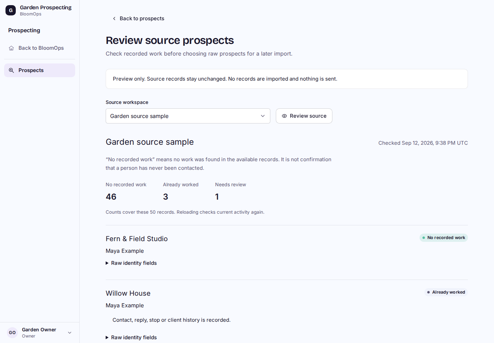
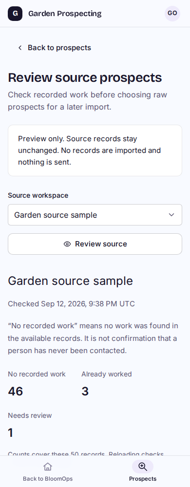

# P2A source eligibility preview

Synthetic local built-Worker captures. No real source records, imports or outreach. This is a separate implementation branch stacked on P1, not a deployed workspace.

| Desktop | Phone |
| --- | --- |
|  |  |

[Desktop record outcomes](source-records-1440.png), [phone record outcomes](source-records-390.png) and [320px layout](source-320.png).

Choose an available source explicitly. Each record shows **No recorded work**, **Already worked** or **Needs review**, with reasons and raw identity fields in a disclosure. A New stage cannot override recorded sends, suppression or earlier work. Counts describe only the current page; no-work status is not proof of never being contacted.

## Verification

- [26 built-browser and native local D1 checks](results.json) pass at 1440, 1024, 768, 390 and 320px. Covered explicit choice, all outcomes, raw field labels, keyboard traversal, mobile controls, pagination, empty source, invalid cursor, foreign-source denial, revoked source membership and demoted destination membership. No browser runtime errors.
- The same built Worker query runs against actual local D1 with 53 synthetic source records. All source rows, send history and the empty canonical destination remain byte-for-byte unchanged after preview checks. The API has no POST operation. Existing P1 New prospect form remains reachable.
- Eight SQL/classifier tests pass, including missing evidence schema, contradictory history, stale actors, revocation during the query, ambiguous/duplicate/deleted identities and page bounds. Twenty-seven existing profile/workspace/session tests pass.
- Cloudflare build and existing local schema/inherited/domain migrations pass. No new migration or dependency. Desktop and phone captures were inspected; existing Bloom controls, semantic status colors, readable field labels and spaced rows are retained.
- One fresh independent Sol High review completed with no material findings. The reviewer independently reran the eight source tests; build/migration/browser conclusions use the supplied evidence. No review fixes or repeat review were needed.

## Reproduce locally

Use an isolated development worktree/database, repository local schema and migrations, `npm run cf:build`, then the existing `node scripts/navigation-perf-local.mjs --d1-delay-ms 40` built-Worker preview. With the already configured local Playwright/Chromium tooling, run `node scripts/prospect-source-browser-local.mjs /tmp/bloomops-p2a-evidence`. The harness checks development/r2-dev identity first and seeds only synthetic local rows. This environment uses `/tmp/bloomops-pilot-tools` and its Chromium shared-library path; adjust that local tool path if needed. It never executes a deployment or sends real mail. Generated fixtures/evidence stay outside Git; local auth links are never logged.

## Limits and next work

Sources must be active operational workspaces in the currently bound database, with this user's active Owner/Admin membership in both source and destination. This is not a connector to the separate original LTB deployment. Missing legacy evidence schema is unavailable, never silently treated as clean history; that failure is covered by SQL tests, not a separate browser run. No global source total, snapshot guarantee or production performance claim is made.

P2A completes only the eligibility preview. Selected raw export, duplicate-safe import receipts, manual audit mapping and the Skills Library remain unfinished. Original LTB data/voices remain untouched. Real imports, outreach, deployment and all video work/tests remain paused.
