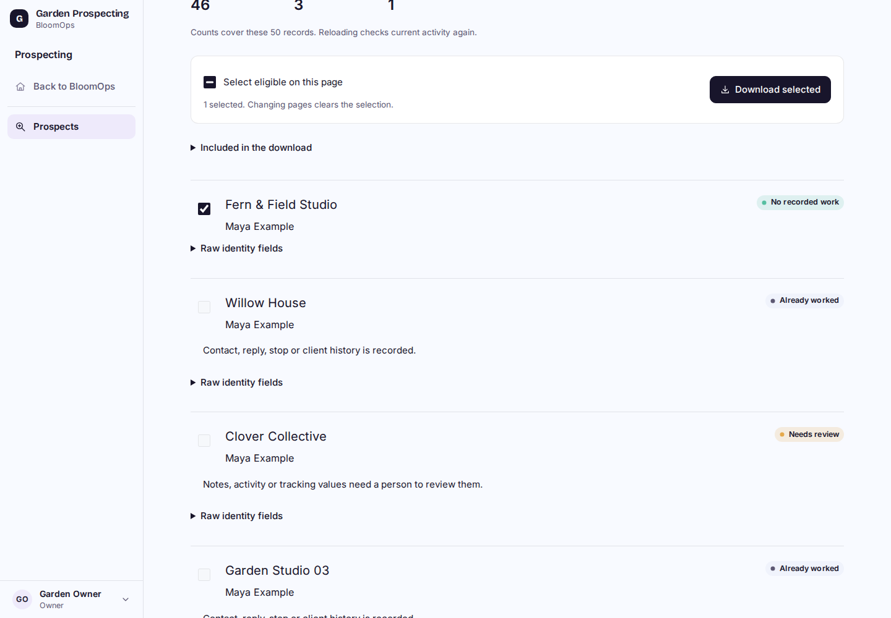
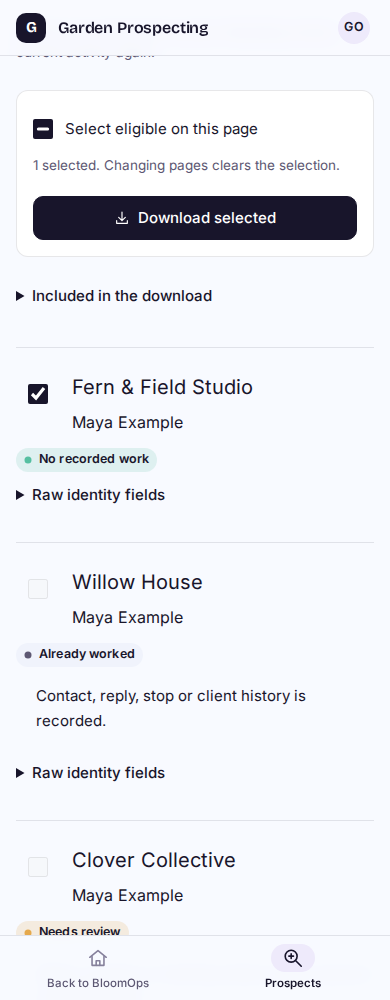

# P2B1 selected raw export

Synthetic local built-Worker captures. This implementation is local and uncommitted, stacked on the accepted P1/P2A work; it is not deployed. No real LTB records, imports, outreach or video work.

| Desktop | Phone |
| --- | --- |
|  |  |

[320px selection](export-320.png) and [a selected record that became ineligible](export-conflict-320.png).

Select individual eligible records or all eligible records on the current page. Downloads recheck current source history and both workspace permissions. One blocked or unavailable selection prevents the whole download and shows a reason. Page/source changes clear selection. Successful downloads contain only seven raw fields and source workspace/record provenance, never old audits, messages or schedules.

## Acceptance

- 18 SQL/classifier/export tests and 27 existing profile/workspace/session regressions pass. Tests include zero database writes, explicit bounded selection, exact raw fields/provenance, changed activity after preview, ambiguity, oversized fields, source/destination revocation, foreign IDs and missing history schema.
- Cloudflare build passes. No new migration, dependency, provider or infrastructure. The built local Worker uses the same existing domain/legacy D1 schema as accepted P2A.
- [60 built-browser/native-D1 checks](results.json) pass across 1440/1024/768/390/320px, including 34 export checks and all 26 P2A checks. Actual downloads match selected raw records and counts; disabled selections, keyboard, busy state, page reset, network retry, stale-history rejection, cross-origin/revoked/foreign access, invalid IDs/body bounds and source preservation pass. Reduced-motion preference was enabled for selection checks. Final desktop/phone captures were inspected.
- One fresh independent Sol High review completed with no material findings. The reviewer independently reran all 18 source/export tests, checked the scoped diff/syntax and inspected desktop/phone/error captures. Build/browser/native-D1 conclusions use supplied evidence. No fixes or re-review were needed. See [BUILD_STATE](../../BUILD_STATE.md) for delivery status.

The browser fixture deliberately inserts a synthetic send event between preview and download to prove stale-selection rejection. Source and destination snapshots are checked before and after application operations, with that explicit fixture change accounted for. No real email is sent.

## Reproduce

Use the existing isolated local D1/R2 setup and `npm run cf:build`, then `node scripts/navigation-perf-local.mjs --d1-delay-ms 40`. With the configured local Playwright/Chromium installation, run `node scripts/prospect-source-browser-local.mjs /tmp/bloomops-p2b1-evidence --export`. This environment needs `/tmp/bloomops-pilot-tools/libs/usr/lib/x86_64-linux-gnu` in `LD_LIBRARY_PATH`; the harness uses Playwright from `/tmp/bloomops-pilot-tools`. The development/r2-dev health guard runs before synthetic fixture creation. Credentials and generated fixture SQL are not committed.

## File format and limits

The JSON file is `bloomops.raw-prospects`, version 1, with an export time, counts and at most 50 selected records. Each has `provenance: {sourceWorkspaceId, sourceRecordId}` and `fields: {businessName, personName, website, publicEmail, niche, country, source}`. Nulls and raw spelling are preserved; a website can remain a bare domain. This is an editable snapshot, not an import receipt, eligibility guarantee or permission to access an old workspace.

P2B2 must validate/map fields, preview invalid and duplicate records, recheck eligibility and create durable repeat-safe import receipts. Full P2B/P2 remains unfinished. Original LTB data/voices are unchanged; source selection still only covers permitted operational workspaces in the current database, with no separate LTB connector. Real imports, outreach, deployment and all video work/tests remain paused.
