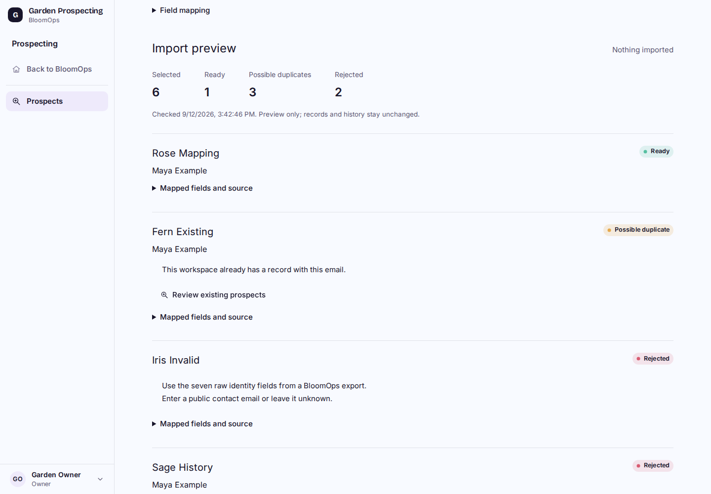
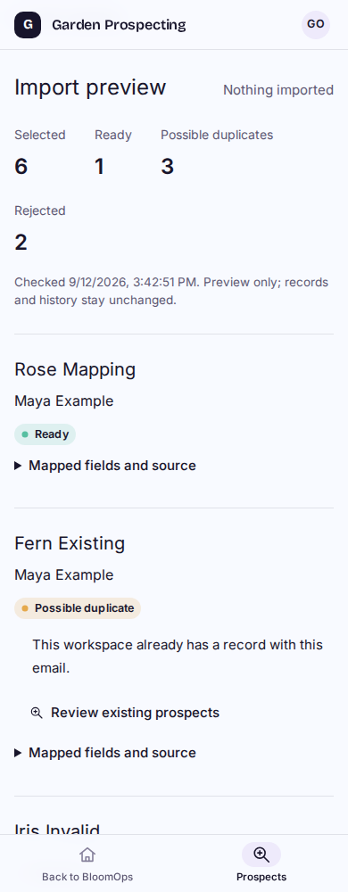

# P2B2 import mapping preview

Synthetic local built-Worker captures. Work is local and uncommitted, with no import, deployment, outreach or original-LTB connection.

| Desktop | Phone |
| --- | --- |
|  |  |

[320px result](import-320.png) and [invalid-file error](import-error-320.png).

Choose a version-1 raw export and preview its canonical profile fields. Source identities and eligibility are rechecked; edited or stale fields are rejected. Possible duplicates are flagged within the file and current workspace. Each row explains its outcome, with mapped fields/source provenance in a disclosure. Nothing is imported, merged or overwritten.

## Acceptance

- 60 distinct focused tests pass: 15 import-preview/body-bound tests and 18 source/export regressions rerun after the review fixes, plus 27 unchanged profile/workspace/session regressions from initial acceptance. Tests cover mapping/normalization, forged counts/fields/provenance, invalid formats/rows, source changes, duplicate batches, cross-workspace isolation, revoked authority during reads and zero database writes.
- [65 built-browser/native-D1 checks](results.json) pass: 39 import checks plus 26 P2A regressions at 1440/1024/768/390/320px. Actual exported JSON is selected and checked through the built Worker; counts, mapped URL/location/provenance, duplicate links, focus, file target size, busy/clear/error/retry behavior, file/body limits and revoked/foreign/cross-origin access pass. Reduced-motion preference was enabled. Desktop/phone/error captures were inspected.
- Cloudflare build passes. No migration or dependency. Native local source rows, send history and destination profiles are unchanged by all preview operations; explicit synthetic fixture creation/send evidence is accounted for before preservation comparisons.
- The independent Sol High review found two medium issues, now fixed: every valid repeated source identity is grouped even when one copy has invalid fields, and incomplete duplicate-query output fails closed. Both have targeted passing tests. Final browser verification passes all 65 checks, including the repeated source identity with an invalid copy. The one focused Sol High re-review confirms both findings resolved with no blocker and independently passes all 15 import-preview tests. P2B2 is accepted locally. The tool’s agent-thread limit prevented a fresh thread, so this separate review uses the configured existing Sol High reviewer.

## Reproduce

Use the existing isolated local schema and development D1/R2 setup, `npm run cf:build`, and `node scripts/navigation-perf-local.mjs --d1-delay-ms 40`. Run `node scripts/prospect-source-browser-local.mjs /tmp/bloomops-p2b2-evidence --import` with the existing Playwright/Chromium tools. This environment uses `/tmp/bloomops-pilot-tools`, with `/tmp/bloomops-pilot-tools/libs/usr/lib/x86_64-linux-gnu` in `LD_LIBRARY_PATH`. The fixture checks development/r2-dev identity before any local seed; auth links and secrets are not logged or committed.

## Limits and next task

JSON only, up to 50 records and 1 MiB. Country maps to Location; source label/IDs remain provenance. Existing-workspace matching uses email, business name and complete website, with SQLite's case handling; it is a conservative possible-duplicate check, not fuzzy identity resolution or automatic merging. File counts and provenance are not authority. This is a dated preview, not a commit token.

P2B3 must add durable source mappings, repeat-safe import receipts and explicit commits with fresh eligibility/permission/duplicate checks and concurrency guards. Full P2B/P2 remains unfinished. Real imports, outreach, deployment and all video work/tests remain paused; original LTB data and voices are untouched.
