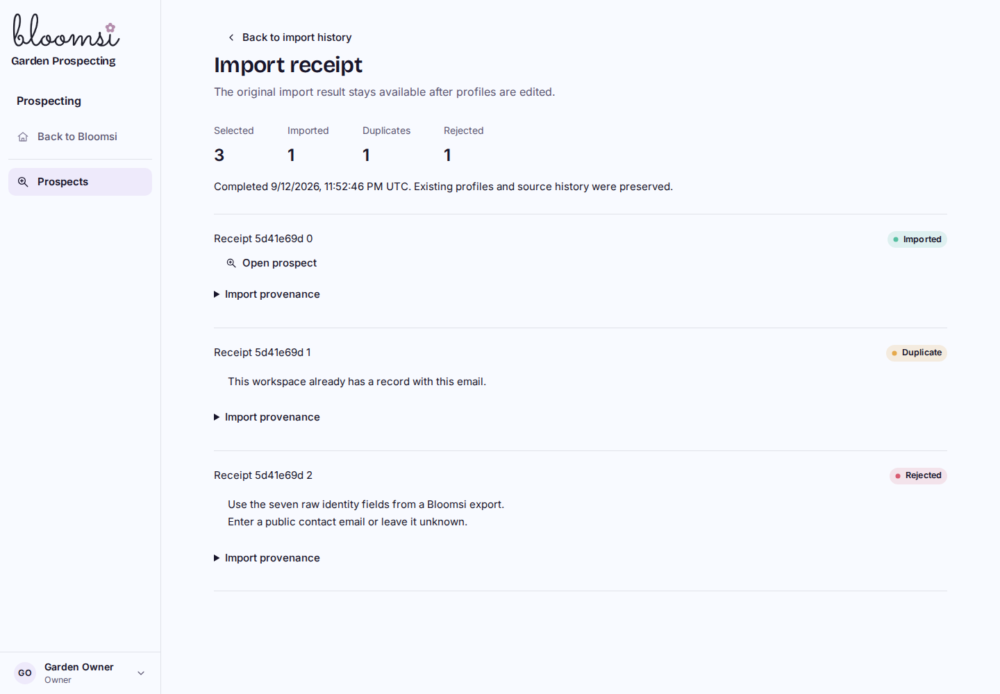
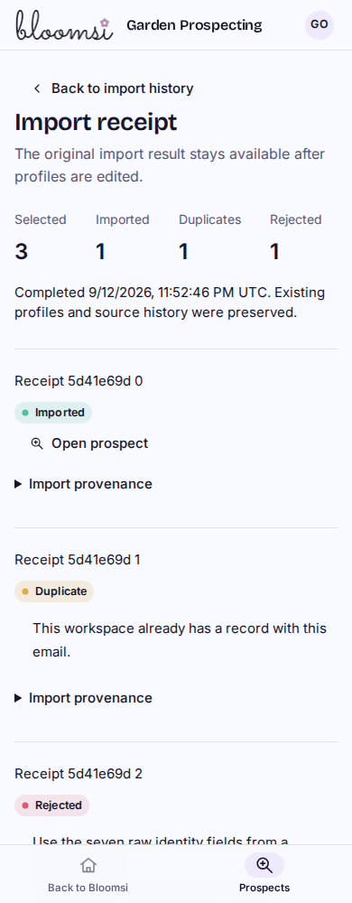

# P2B3 durable import receipts

Synthetic local built-Worker preview. P2 remains local and uncommitted; staging still contains the separately deployed Bloomsi branding only. No real import, outreach, original-LTB connection or video work/tests.

| Desktop | Phone |
| --- | --- |
|  |  |

[320px receipt](receipt-320.png), [imported profile provenance](imported-profile-320.png), and [source-change conflict](commit-conflict-320.png).

The explicit import button adds every Ready row in the reviewed file. A durable receipt reconciles Imported / Duplicate / Rejected outcomes and links to each new profile. Source provenance remains available after manual edits. An interrupted response can be retried with the same request identity or recovered from Import history. Changed records require a fresh explicit action.

## Acceptance evidence

- 142 distinct focused tests pass across source/export/import, profiles/workspaces/session, schema and shared branding regressions. The final import/preview run passes all 36 affected tests. Coverage includes concurrent requests, edited identity, stale source/duplicate/permission state at write time, atomic rollback, retained provenance, manual verification and request/file bounds.
- Final Cloudflare build passes. Additive migration `0026` brings this branch from 26 to 27 domain migrations and 48 to 50 domain tables. The populated local database preserves all seven watched tables exactly; integrity/FKs pass and repeat migration is a no-op. Disposable fresh/repeat migration verification passes.
- [97 built-browser/native-D1 checks](results.json) pass across all five widths, including the actual 50-record export/preview/concurrent commit, response loss/retry, source preservation, receipt navigation/isolation and stale-source recovery. After the final request-ID type guard, the rebuilt Worker passes [four targeted API checks](request-boundary-results.json): UUID arrays/objects are rejected, a valid string reaches the expected duplicate conflict, and no writes occur. Desktop, phone, provenance and conflict captures were inspected.
- One fresh GPT-5.6 Sol High read-only review found no material correctness, authorization, isolation, migration or data-loss defects. It traced the final runtime and request-type guard and inspected the supplied tests, native evidence and captures. No review fixes or re-review were needed. The reviewer did not rerun stateful checks; that limitation is explicit. No remaining material finding. P2B3/P2B is accepted locally.

The native maximum-size check exposed a compound-SELECT limit in the earlier duplicate-preview query. It now uses a bounded VALUES CTE with the same per-ordinal completeness, current-authority and duplicate checks. SQLite-only tests did not expose that runtime difference. Import completion uses [D1's transactional batch behavior](https://developers.cloudflare.com/d1/worker-api/d1-database/#batch), with source checks and receipt completion guards inside the batch; the 50-record test also checks the [100-bind statement limit](https://developers.cloudflare.com/d1/platform/limits/).

## Reproduce

Use the isolated development D1/R2 setup and local migrations. Build with `npm run cf:build`, then run `node scripts/navigation-perf-local.mjs --d1-delay-ms 40`. With the existing Playwright/Chromium tools, run `node scripts/prospect-source-browser-local.mjs /tmp/bloomops-p2b3-evidence --commit`. This environment uses `/tmp/bloomops-pilot-tools`, with `/tmp/bloomops-pilot-tools/libs/usr/lib/x86_64-linux-gnu` in `LD_LIBRARY_PATH`.

The harness verifies development/r2-dev before creating isolated synthetic fixtures. It exercises actual file preview/import, lost-response retry, receipt/profile/history navigation, denied access, conflict recovery and a concurrent 50-record import at 1440/1024/768/390/320px. Fixture creation and deliberate fixture state changes are separate from source-preservation comparisons around import operations. No auth links, secrets or real records enter these captures.

## Limits and next

JSON only, 1–50 records and a 1 MiB file. Duplicate matching is conservative, using source identity, email, business name and exact website with SQLite case handling; there is no fuzzy matching or implicit merge. Receipts describe the original import, while profile fields continue to evolve. Import never marks public contact data delivery-verified. Access to both workspaces is still required for commit retries; destination authority controls retained receipt/provenance reads.

P2C is the next bounded task: versioned manual audit/outreach/follow-up skills and canonical context export, followed by an explicit conflict-safe structured round trip. Full P2 remains unfinished. Publication/deployment, real imports, outreach and video work/tests remain paused.
