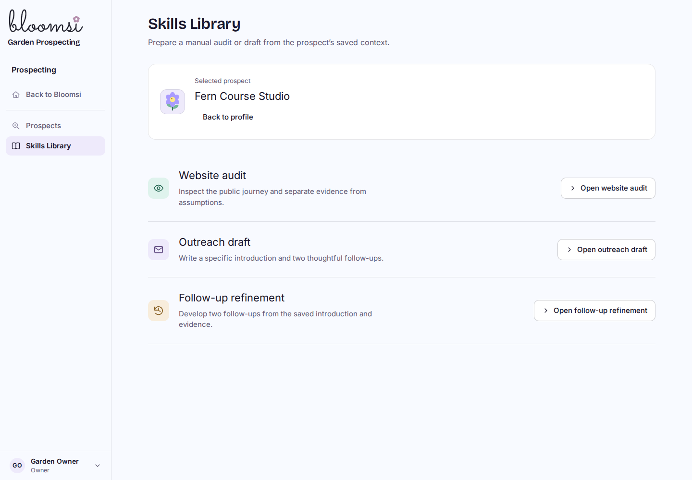
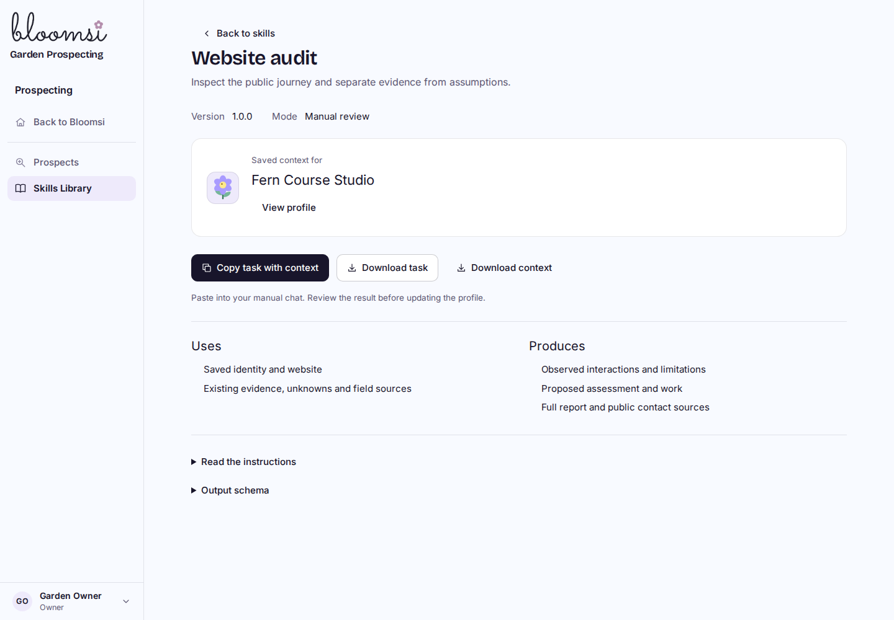

# P2C1 manual Skills Library

Synthetic local built-Worker preview. Work remains local and uncommitted; P1/P2 are not deployed. No paid AI call, real import, outreach, original-LTB connection or video work/tests.

| Library | Manual task |
| --- | --- |
|  |  |

[Phone library](library-390.png), [320px task](skill-320.png), [clipboard fallback](clipboard-fallback-320.png), [stale-context recovery](stale-context-320.png), and [profile entry point](profile-320.png).

Choose Website audit, Outreach draft or Follow-up refinement. Open a profile’s Use a skill action to carry its explicit selection into the library. Copy task with context includes the versioned instructions, JSON output schema and current saved fields. Downloads provide either the full task or context JSON; an unselected skill offers standalone instructions and a clear path to select a prospect. Long instructions/schema stay in named disclosures.

## Verification

- 41 distinct focused tests pass: 11 skill/context tests plus 30 existing profile/workspace/shell regressions. The final 11 affected tests pass after the reviewed schema correction; 28 affected skill/shell tests passed after visual self-review changes.
- 42 schema/example checks pass with the already installed Python jsonschema Draft7Validator and FormatChecker. Valid ready and uncertain examples pass; empty/whitespace drafts, absent introductions, empty reports, undated/unsourced/unobserved ready audits, delivery claims and invented prices fail. Fixtures are hand-authored synthetic contract examples, not live audits or model evaluation. No runtime/package dependency was added.
- Final Cloudflare build passes. No migration; existing 27 domain migrations and 50 domain tables are unchanged. Canonical context includes saved fields and field/import provenance, omitting activity, user identity and unrelated records. Every export is read-only and rechecks the selected profile revision and current workspace authority after provenance reads. Stale skill versions also require reload.
- All 50 final built-browser/native-D1 checks pass across 1440/1024/768/390/320px. Desktop and phone library/task/fallback captures were inspected. Clipboard, downloads, reload/retry, keyboard focus, access denials and read-only exports pass. Every pre-slice row in nine watched tables remains unchanged; integrity and foreign keys pass. See [browser results](results.json), [schema checks](schema-validation.json) and [preservation proof](preservation-final.json).
- One fresh Sol High review and its single focused re-review are complete. The empty-ready-output finding is resolved with no remaining material issue. The reviewer checked the runtime schemas, synthetic fixtures, 42 schema checks, 11 affected tests and final build; it did not independently rerun stateful browser checks. The owned preview is stopped.

The initial native fixture expected HTTP 200 on profile creation; the existing route correctly returns 201 and the assertion was corrected. Visual self-review added the missing shared history glyph for Follow-up refinement and constrained the input/output grid. Independent review found that an empty result could validate as ready; the schema now requires nonblank reports/follow-up bodies, a nonblank ready introduction, and dated/sourced observed evidence for a ready audit. No result is automatically applied.

## Reproduce

Use the isolated development D1/R2 setup with the current local migrations, `npm run cf:build`, and `node scripts/navigation-perf-local.mjs --d1-delay-ms 40`. Run `node scripts/prospect-skills-browser-local.mjs /tmp/bloomops-p2c1-evidence` using the existing Playwright/Chromium tools. This environment uses `/tmp/bloomops-pilot-tools`, with `/tmp/bloomops-pilot-tools/libs/usr/lib/x86_64-linux-gnu` in `LD_LIBRARY_PATH`.

The harness verifies development/r2-dev before creating synthetic workspaces and profiles. It tests clipboard success/denial, actual downloads, busy/error/retry/focus, stale profile reload, explicit selection, role/workspace/revocation/origin/body denials, five widths and unchanged domain records around exports. Explicit synthetic profile edits and membership changes are accounted for separately. No auth links or secrets enter captures.

## Limits and next

The task uses a dated snapshot, not a lock or write authorization. Context has no approved price/claim source or sending permission. Skills preserve uncertainty, distinguish public contact discovery from delivery verification, and keep GHL/direct-PDF/popup/calendar/hidden-text corrections. A schema validates shape and required evidence fields; it does not establish that observations or drafts are true or useful. Human review remains necessary.

P2C2 is next: validate structured results, preview changes against the exported revision, preserve the full report and resolve conflicts with manual edits before applying anything. The complete round trip and broader P2 acceptance remain unfinished. No production/DNS change, real imports, outreach or video work/tests.

The external Bloomlab gallery was unavailable during preflight; the committed design system/checklist and profile image/corrections were inspected. GitHub CLI’s Windows sign-in bridge was unavailable; Git fetch/ls-remote confirmed main `651d9a5` and PR #60 head `67b94eb`. Neither limitation blocked local implementation or verification.
