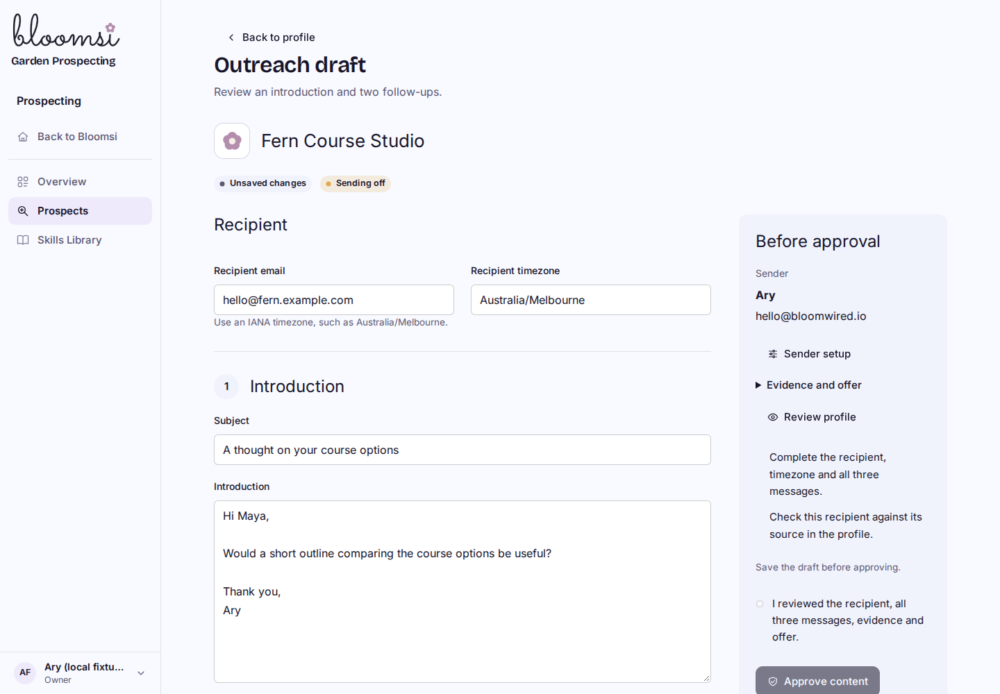
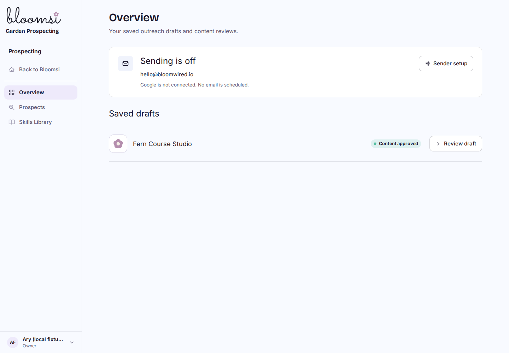
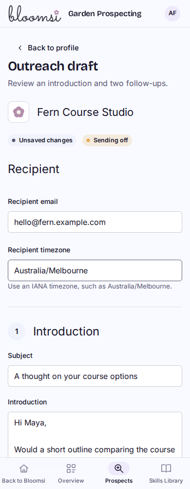
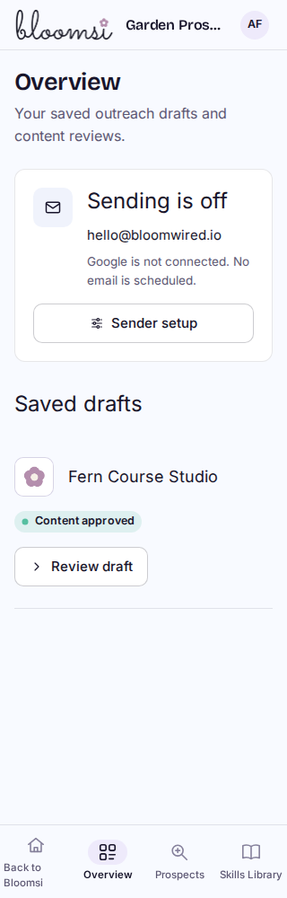
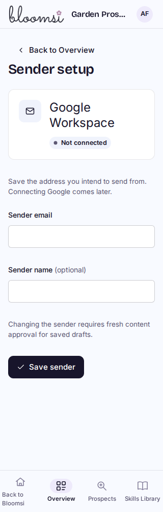
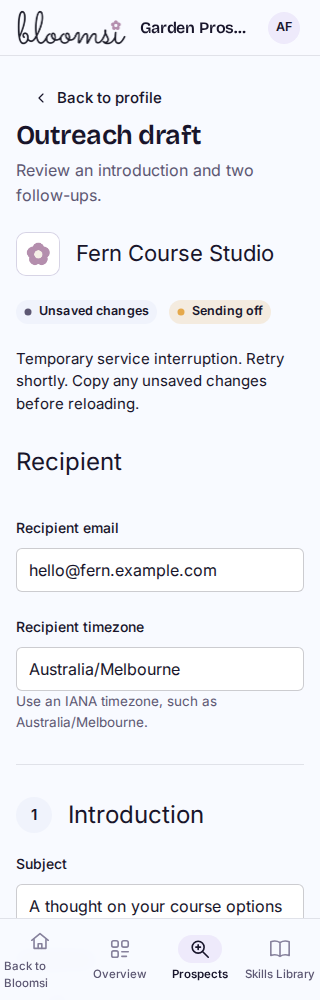

# P3A local visual preview

Built Bloomsi Worker with synthetic local D1 fixtures. These are actual browser captures, not mockups. P3A is local/uncommitted; staging still contains the separately deployed branding. Nothing connects Google, sends or schedules email.

The sender form saves this workspace's chosen Google Workspace identity. A full-page draft holds the recipient/timezone, introduction and two follow-ups. Explicit saved-result selection supplies follow-up suggestions for review. Content approval binds current sender/profile/draft versions; changes and approver revocation invalidate it without removing history. Overview lists saved drafts only, with no fabricated urgency or provider counters.

## Desktop

## Phone

## Verification and limits

- 78 distinct focused tests pass, including all 21 affected P3A SQL tests and 17 shell checks after changes.
- Final Worker build and 58 final native/browser checks pass at 1440, 1024, 768, 390 and 320px. Captures were inspected for layout/hierarchy; controls, keyboard acknowledgement, busy/error/retry/focus, stale edits, unload protection, normalization, source-result selection, current authority and concurrent approval were exercised.
- Favicon success uses the existing application ICO served from an isolated local HTTP fixture; failure preserves the stable garden SVG. It is a test image for a fictional prospect, not a claim about a real business. Playwright aborts `/favicon.ico` requests before mock routing, so the final harness uses the real local endpoint rather than a mocked favicon request.
- Additive migration `0028`: 29 domain migrations/54 tables. Populated/repeat and isolated fresh/repeat checks pass. Every pre-slice row across 87 tables remains intact; integrity and foreign keys pass.
- One fresh Sol High review identified unsaved-edit protection, misleading outreach activity metadata and normalization producing a false unsaved warning. Fixes are verified; the single focused re-review is recorded in BUILD_STATE.

Evidence, logs and pre-slice source/DB snapshots: `/home/ary/Developer/bloomops-prospecting-p3a-evidence/`. The harness is `scripts/prospect-outreach-browser-local.mjs`; it requires the built development Worker on localhost:8787 and the existing local Playwright installation. It creates only isolated synthetic fixtures. Google consent/OAuth, credentials, real imports/outreach, production/DNS, deployment and video work/tests were not performed.
