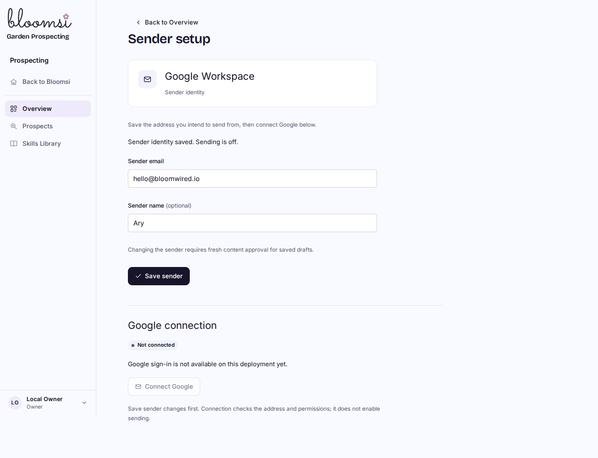
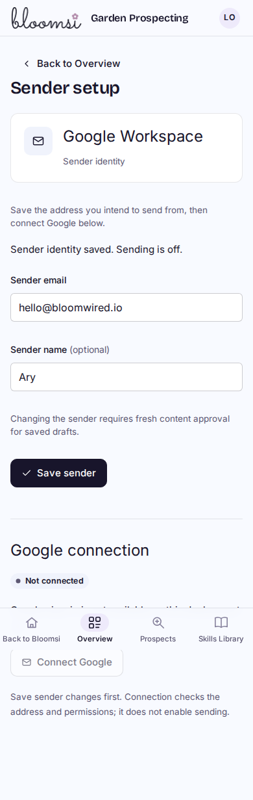
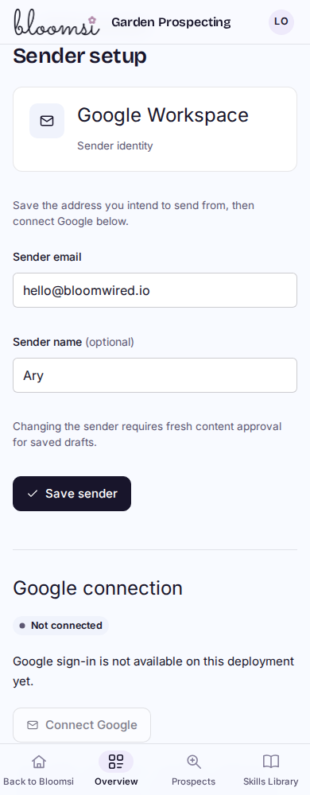
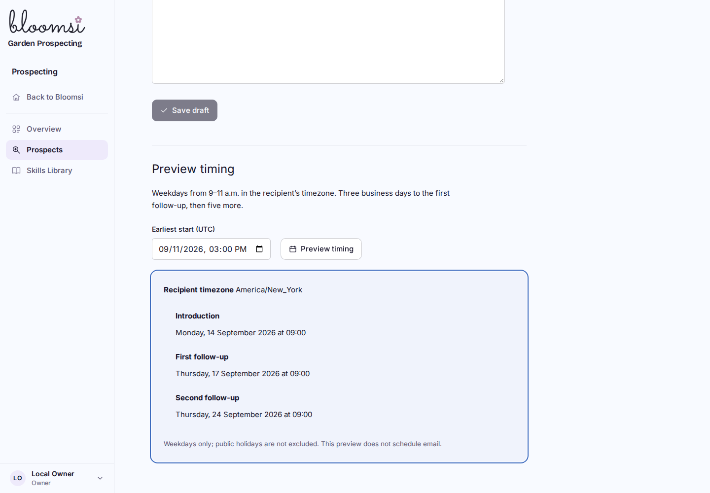
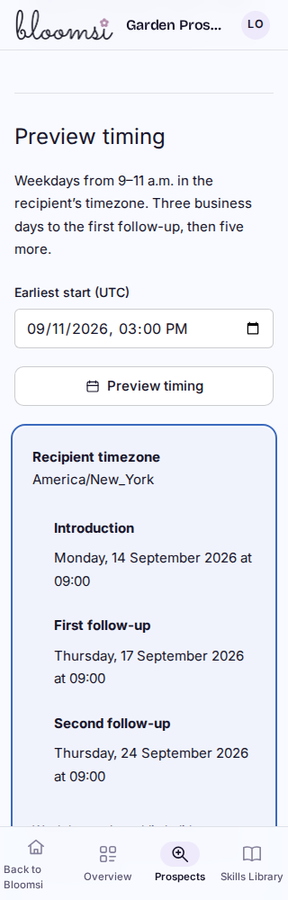
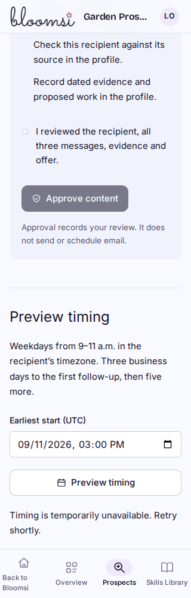

# P3B local visual preview

Built local Cloudflare Worker against native development D1, with a separate synthetic Prospecting workspace. The exact Bloomsi logo and existing layout are retained. These are local screenshots, not a deployed preview.

## What is shown

- Sender setup has a distinct Google connection section. Missing deployment configuration disables Connect Google and explains its unavailable state. Saving a sender refreshes connection state without a page reload.
- Read-only timing preview shows the introduction and two follow-ups, using the saved recipient timezone and three then five business-day intervals. It does not schedule or send.
- The tested Friday 11 a.m. New York earliest start becomes Monday 14 September at 09:00, then Thursday 17 and Thursday 24 September at the same local time.

## Evidence and limits

The built-browser/native-HTTP harness passes 48 checks at 1440/1024/768/390/320px: layout and 44px/16px timing controls; keyboard/focus/error/retry; pending requests and stale response suppression; exact dates; read-only persistence; revision/origin/body limits; callback redirects; and role/workspace/revocation denial. Desktop and phone captures were inspected. The full-page phone sender capture includes the fixed mobile navigation at its viewport position; the live page scrolls beneath it.

A separate native D1 harness verifies Google grants with injected synthetic provider responses. Both an accepted custom alias and an authenticated primary address without a custom-alias verification flag are covered. It also checks state replay/concurrency, encrypted workspace separation, disconnect and live revocation. No real Google account was contacted or connected. Live consent, token refresh/revocation detection, delivery, replies and Results are not accepted by these screenshots.

Evidence: `/home/ary/Developer/bloomops-prospecting-p3b-evidence/`. Commands: `node --test tests/bloomops-prospect-google.test.mjs tests/bloomops-prospect-schedule.test.mjs tests/bloomops-prospect-outreach.test.mjs tests/bloomops-schema.test.mjs tests/bloomops-shell.test.mjs`; `npm run cf:build`; `node scripts/prospect-google-native-local.mjs <evidence>`; `node scripts/navigation-perf-local.mjs --d1-delay-ms 40`, then `LD_LIBRARY_PATH=/tmp/bloomops-pilot-tools/libs/usr/lib/x86_64-linux-gnu node scripts/prospect-google-browser-local.mjs <evidence>`. The provider review fix reran all 18 Google tests and the native harness plus Worker build. Final visual inspection also found a focused phone error beneath the fixed navigation; scoped notice scroll margins correct that. The browser harness now checks that the complete focused error is above the navigation. A subsequent final build/browser run covers that styling correction. BUILD_STATE owns final review acceptance.
