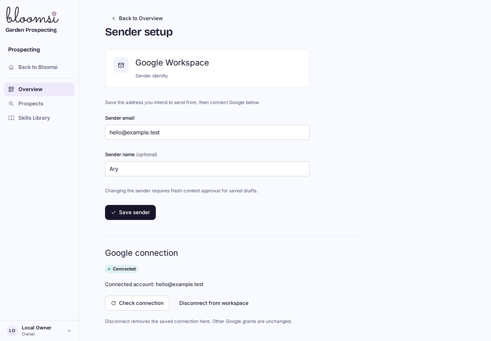
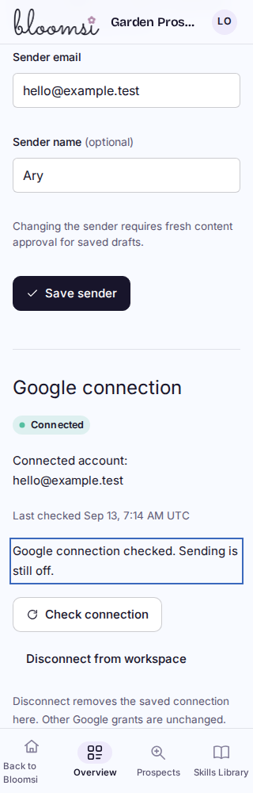
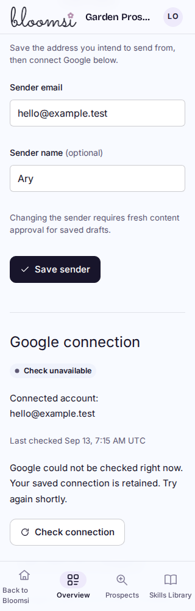
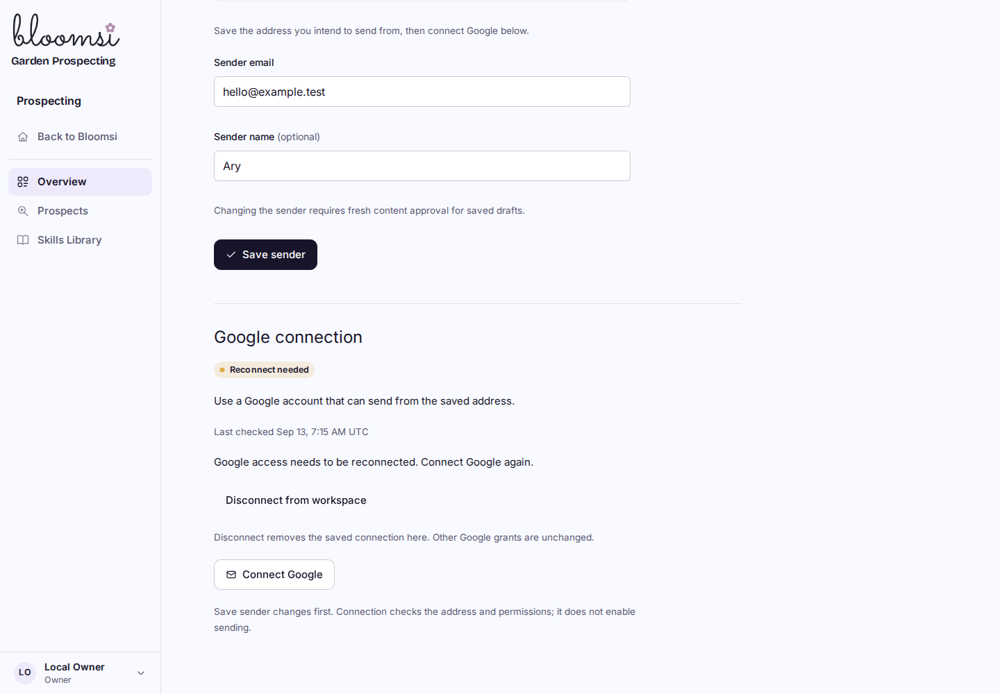

# Prospecting P3C1 connection reliability preview

Local uncommitted implementation on `feat/prospecting-p2-eligibility`; not deployed. The existing Bloomsi logo, form layout and spacing are preserved.

Check connection refreshes Google access and verifies the account/sender. Expired access shows Check needed; temporary failures retain the encrypted grant and allow retry; confirmed invalid access requests reconnection. Checks never send email.

These are real built-Worker browser captures with a separate synthetic workspace and local D1/R2 on port8788. Every provider request is intercepted in the isolated harness; failure examples did not revoke or modify the owner's real grant. Captures show viewport positions, including focus and fixed mobile navigation.

Verification: 78 focused tests; native workerd consent/refresh success and30redirect cases; 15 native D1 checks; 36 final browser/native HTTP checks at1440/1024/768/390/320px; final Cloudflare build; additive0030 populated/fresh/repeat migration proof. Independent review and controlled real refresh status are recorded in [BUILD_STATE](../../BUILD_STATE.md).

Evidence: `/home/ary/Developer/bloomops-prospecting-p3c1-evidence/`. The browser harness uses the existing Playwright dependency libraries via `LD_LIBRARY_PATH=/tmp/bloomops-pilot-tools/libs/usr/lib/x86_64-linux-gnu`. It never uses the owner's preview on8787.
