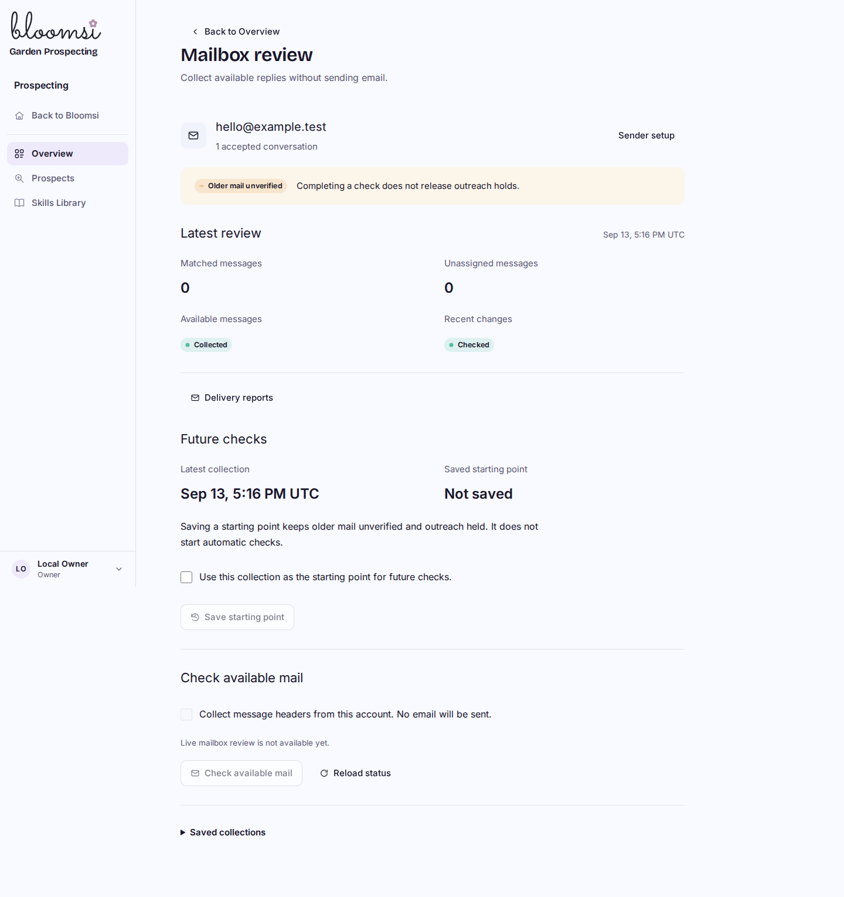
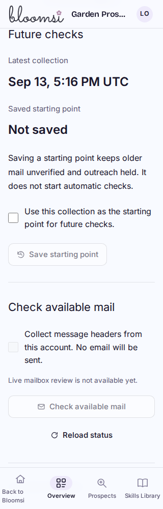

# Reviewed mailbox starting point

Synthetic built Worker captures from P3C3F1, using isolated local D1 and intercepted provider egress. Desktop1440 and mobile320 controls shown;1024/768/390 and saved/error/disabled/expired/changed states also checked. Mobile collection and saved-point dates stack as labelled fields. Existing Bloomsi shell and navigation remain.

The user explicitly acknowledges a recent completed collection as the starting point for future checks. Saving makes no provider request, starts no automatic monitoring and leaves older mail unverified and all outreach held. A saved point is separate from an unfinished later attempt.

Verification:56 built-browser checks pass with keyboard/reduced-motion/loading/error/replay/authority/privacy coverage and zero provider requests. Native D1 separately passes15 checks, including100 targets and permanent-stop preservation. Final review status lives in [BUILD_STATE](../../BUILD_STATE.md).
