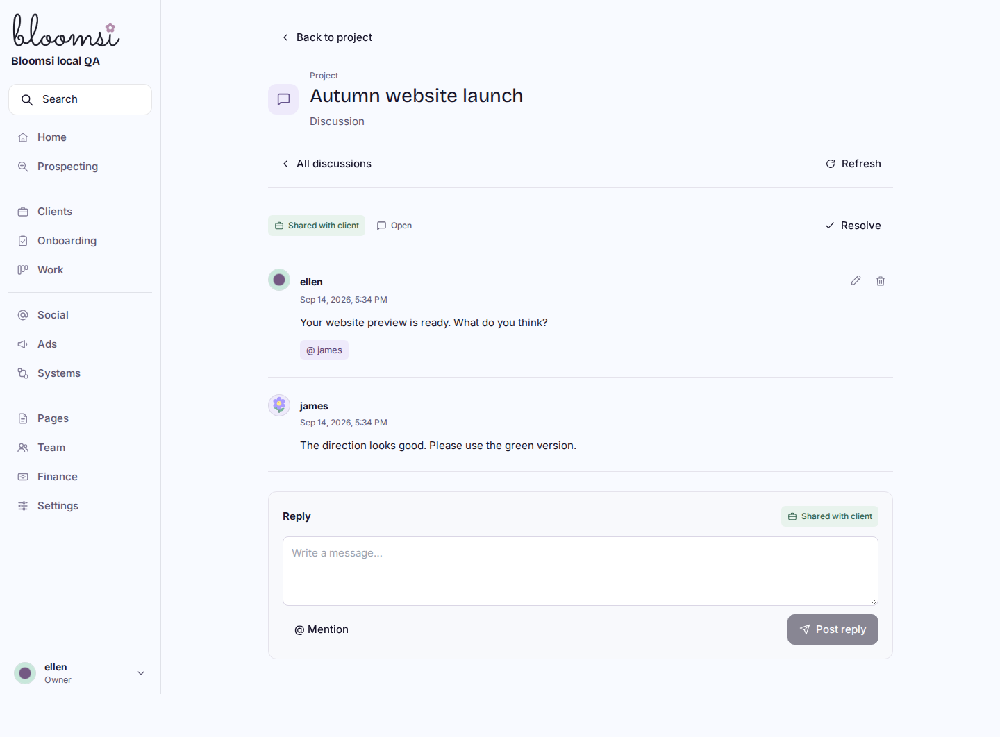
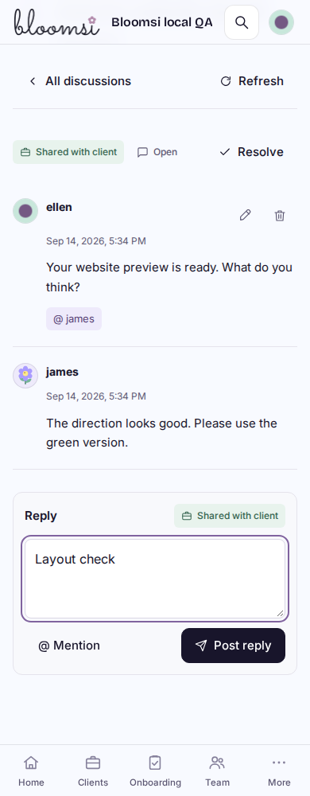
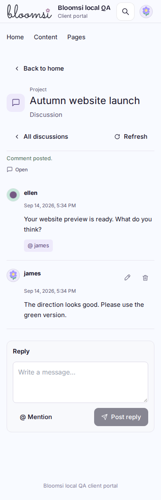
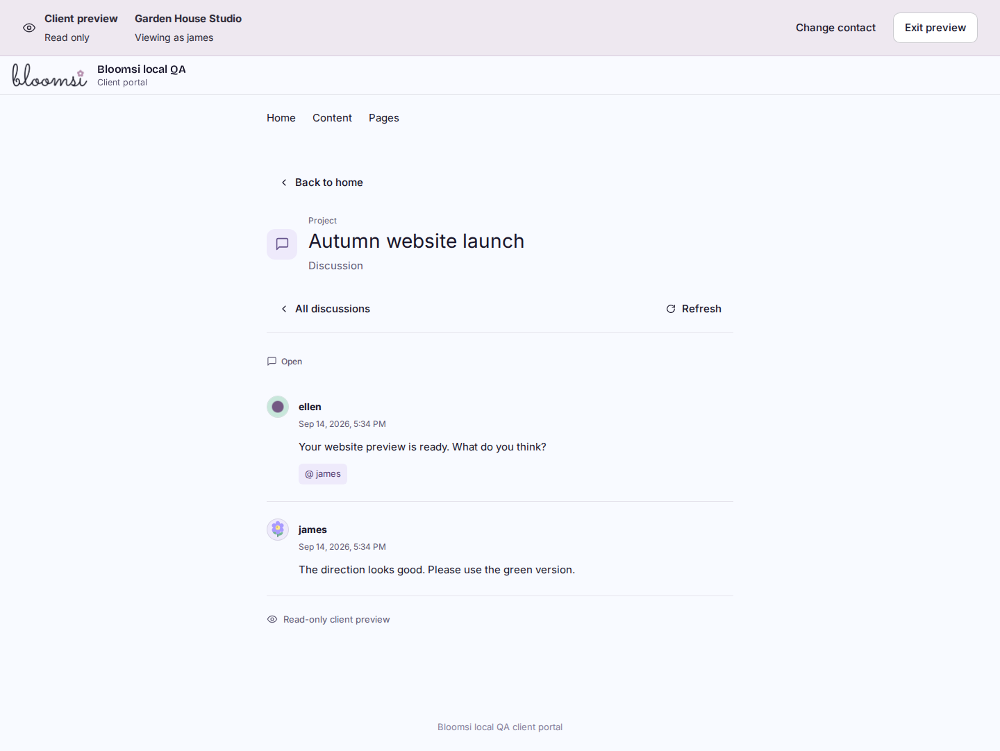
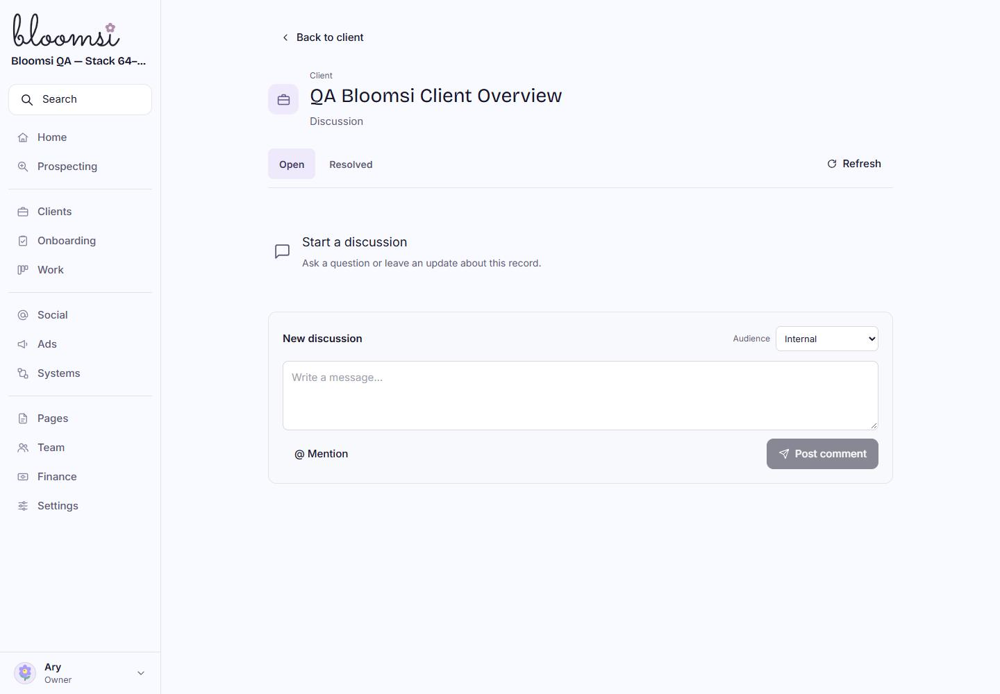
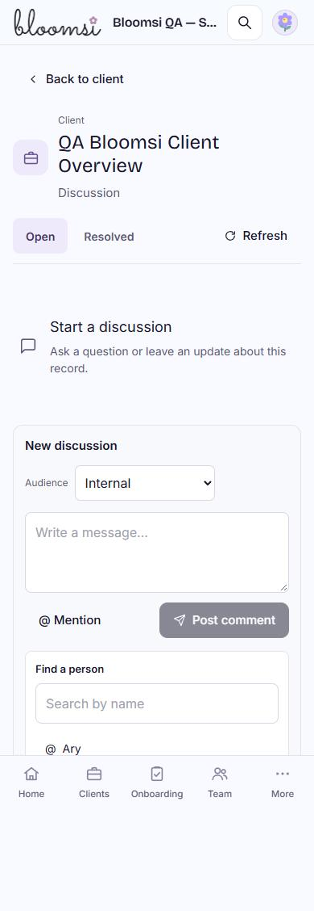

# Record discussions — N2D

Implemented in `feat/n2-record-discussion`, based on merged main `0c9bcc9`. One fresh Sol High read-only review found no material issues; no re-review was needed. Accepted in staging on `6d608286d0978f0ca99a29369186014dbe122246` through successful [workflow34914352231](https://github.com/Bloomwired/bloomops/actions/runs/34914352231). A subsequent CSS-only correction uses the existing Bloomsi heading-font token; its11 focused visual checks pass at all five widths, with no runtime errors. The final OpenNext build also passes.

Clients, Projects, Tasks and Deliverables now link to full-page discussion. Threads have a fixed internal/client audience, readable plain-text replies, selected permitted mentions, own edit/removal, resolve/reopen and protected author photos. Client portal and staff preview reuse current parent authority. Preview has no writes. Existing Page discussion remains unchanged. In-app notification delivery is N2E; this slice sends no collaboration email.

## Visual evidence

Fictional local workspace, actual built Worker/D1/R2. Exact screenshots, not mockups.

## Verified locally

- 79 focused Node checks across record discussions, profile photos, client preview and authorization. Final discussion file15/15 includes Client task denial and portal-only deliverable labels.
- OpenNext build passes. No standalone lint/typecheck script exists; the build runs its configured checks.
- Additive migration0045 introduces three discussion tables with typed-parent and workspace/project foreign keys. Local upgrade passes. Isolated zero-to-current and a second unchanged pass pass; no production database was used.
- 43 actual Worker/browser checks pass, plus[11 focused final typography checks](visual-results.json), with zero browser runtime errors. [Machine-readable results](browser-results.json). Five widths1440/1024/768/390/320; keyboard and a real touch context; Post hit tests clear the fixed phone navigation by scrolling.
- Real local posting/replies, selected mentions, lost-response retry without duplicates, failed-edit recovery, explicit stale-edit replacement, own removal preserving replies, resolve/reopen, Client audience denial, no client staff-directory search, real author-photo storage/delivery, read-only preview and photo authorization, anonymous/cross-origin/missing-parent denial and clearing displayed content after failed access verification.

The harness is `scripts/record-discussions-browser-local.mjs`, run against localhost8812 with existing external Playwright tooling and a task-only TMPDIR. No staging records or real mail were used. The external Bloomlab gallery opened, but its screenshot request did not complete; the written design system and actual Bloomsi desktop/phone captures were inspected. QA corrected early-hydration input readiness, deterministic first-render dates, and an unavailable Client task query that returned500. Harness corrections account for accessible icon names, waiting for the post-save read, and scrolling a button clear of the fixed navigation.

## Performance and limits

A thread list uses3 domain SELECTs, a message page5 (30 comments), a people picker2, and an access check1. The measured message response/query count is unchanged with250 extra workspace members. Author images retain two bounded context/pointer SELECTs plus request authentication/R2. These are local query/response measurements, not remote latency claims.

Rounded first-load JS estimates: new discussion112kB; Portal112, Pages118, Prospecting123 and Work108 remain unchanged. Clients161→162kB for shared small controls; client preview118→123kB includes the discussion UI. No rich-text editor, dependency, cache, provider or infrastructure configuration was added. Access is checked per request and after storage; open screens verify on focus/pageshow and every10 seconds, not via pushed events.

N2E notifications, report-version linkage, broader recovery, collaboration email, paid/video work, production/DNS and original LTB records remain outside this slice.

## Live staging acceptance

[Open the QA client discussion](https://staging.ops.gobloomwired.com/discussions/client/097f94a802a8426cb017aa94fcc72d20). [Ten live checks](staging-checks.json) pass: exact runtime/schema46, client entry, empty real read, internal default/disabled empty Post, permitted-person lookup, missing-parent404, phone sizing, live Mention picker, resolved-view/return navigation and restored desktop. No staging record or photo writes were made. Populated conversations, real storage writes and the permission matrix remain local evidence. PR77 remains draft/unmerged at this checkpoint.

